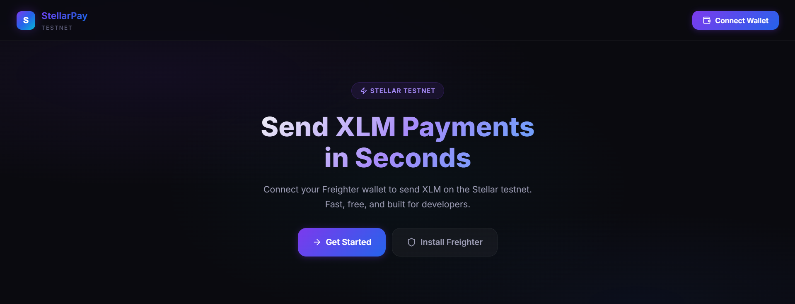
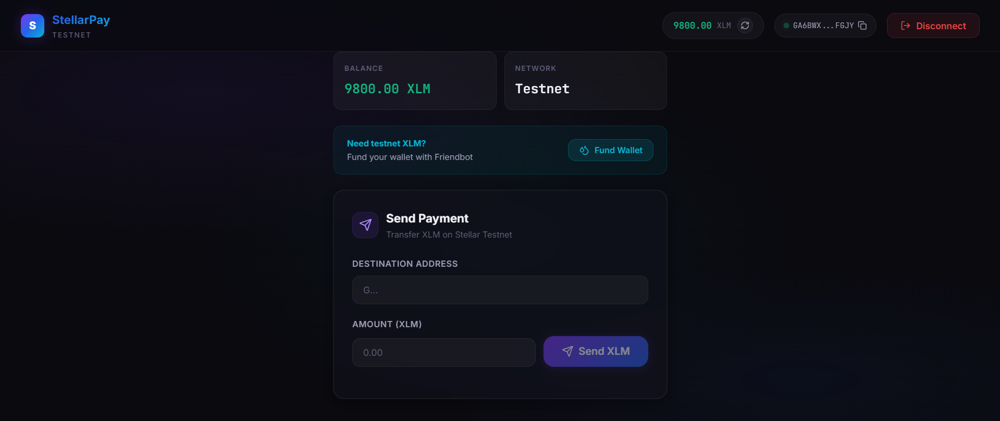
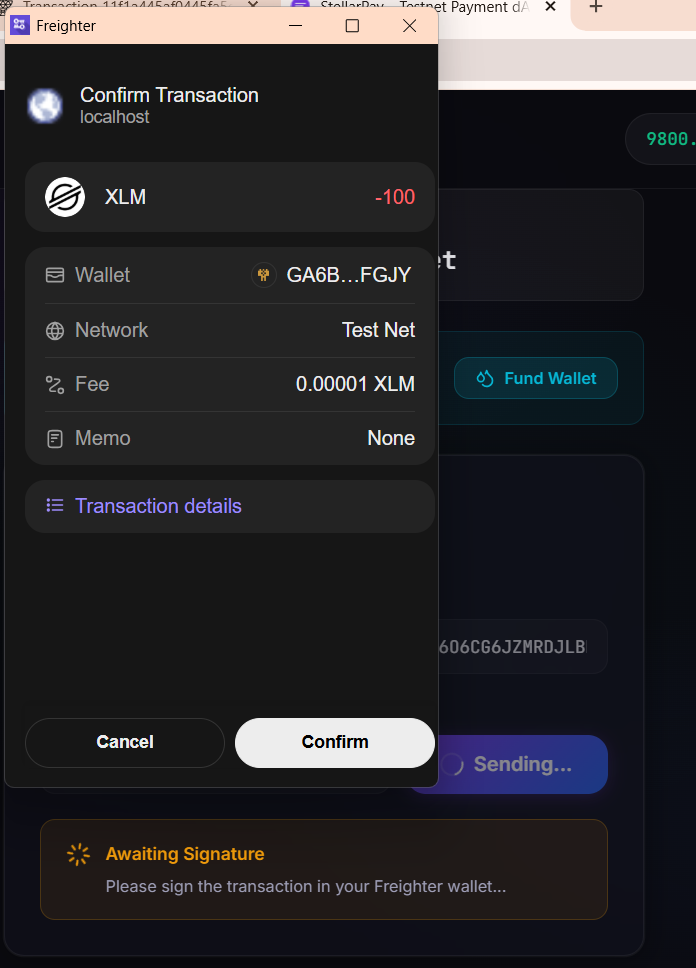
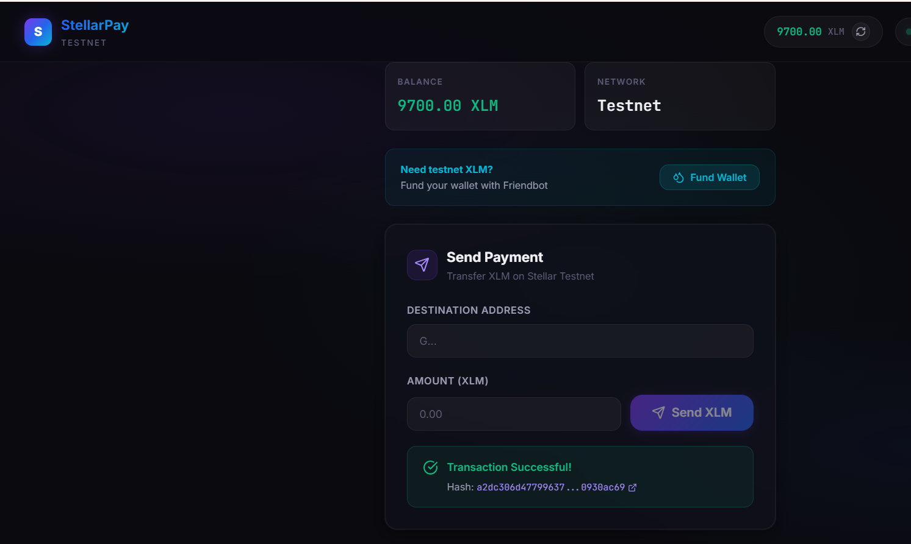
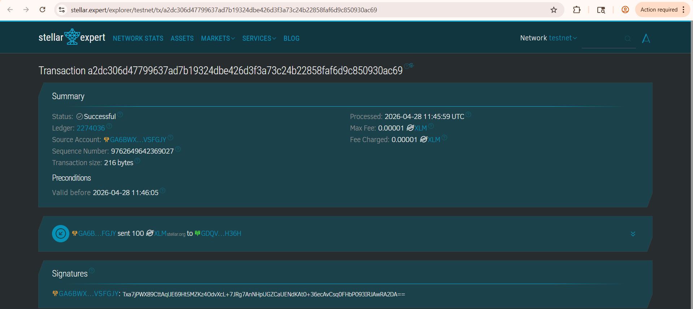

# StellarPay – Simple Payment dApp

StellarPay is a lightweight, modern web application built on the Stellar Testnet. It demonstrates the core fundamentals of Stellar development by allowing users to connect their wallet, check their XLM balance, and send payments securely. This project was built to fulfill the requirements for the **Level 1 – White Belt** Stellar development challenge.

## Features & Requirements Completed

- **Wallet Setup**: Connects to the [Freighter](https://freighter.app/) wallet on the Stellar Testnet.
- **Wallet Connection**: Connect and disconnect functionality with real-time UI updates.
- **Balance Handling**: Fetches and displays the connected wallet's native XLM balance.
- **Transaction Flow**: Build, sign, and submit native XLM payment transactions to the network.
- **Transaction Feedback**: Provides step-by-step visual feedback (signing, submitting, success/error) and outputs the verifiable transaction hash link upon completion.

## Setup Instructions

To run this application locally, you will need [Node.js](https://nodejs.org/) installed on your machine. 

1. **Clone the repository:**
   ```bash
   git clone <your-repo-url>
   cd stellar_connect_wallet
   ```

2. **Install dependencies:**
   ```bash
   npm install
   ```

3. **Run the development server:**
   ```bash
   npm run dev
   ```

4. **Open your browser:**
   Navigate to `http://localhost:5173`. Ensure you have the Freighter wallet extension installed and set to the **Testnet** network.

## Project Showcases

Below are the key states and features of the application demonstrating the challenge requirements:

### 1. Wallet Connected State
*Connecting the Freighter wallet.*


### 2. Balance Displayed
*Fetching and displaying the XLM testnet balance.*


### 3. Signing Transaction
*Requesting the user to sign the transaction via Freighter.*


### 4. Successful Transaction
*Showing real-time transaction submission.*


### 5. Transaction Result
*Transaction completed with the hash displayed to the user.*


## Tech Stack
- **Framework:** React + Vite + TypeScript
- **Stellar SDKs:** `@stellar/stellar-sdk`, `@stellar/freighter-api`
- **Styling:** Vanilla CSS (Glassmorphism & Dynamic Animations)
- **Icons:** Lucide React
